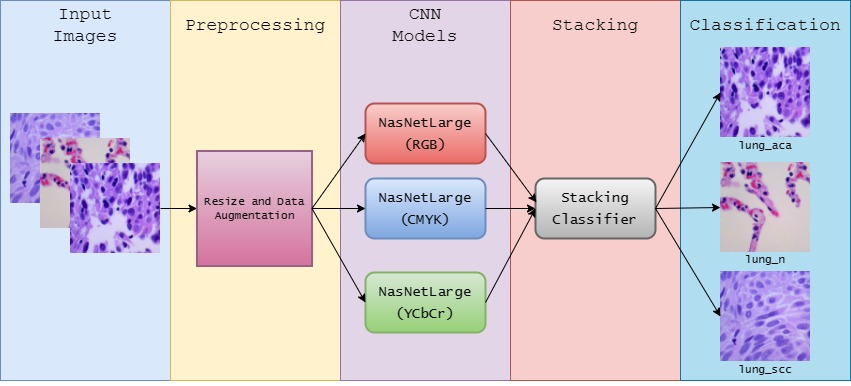

# A Stacking Ensemble Method with Multiple Color Models for Lung Cancer Classification using Histopathology Images

This repository contains the code and documentation for a lung histopathology classification project. The project aims to increase the accuracy of lung tissue classification using ensemble stacking of features extracted from deep learning models trained on images in different color models.

## Highlights

- Utilizes stacked features from multiple deep learning models trained on RGB, CMYK, and YCbCr color-transformed images.
- Employs NasNetLarge architecture for all CNN models, fine-tuned on lung histopathology dataset.
- Ensemble stacking technique combines features from different color models for classification.
- Achieves high classification accuracy of 99.80% on a publicly available lung histopathology dataset.

## Structure

- **Background and Related Study**: Provides context and previous work related to lung histopathology classification.
- **Methodology**: Describes the proposed approach, including data preprocessing, model training, feature extraction, and ensemble stacking.
- **Results and Discussion**: Presents experimental setup, evaluation metrics, performance analysis of individual CNN models, and feature visualization.
- **Limitations and Recommendations**: Discusses limitations of the approach and suggestions for future work.
- **Conclusion**: Summarizes the findings and contributions of the project.

## Evaluation Metrics

The performance of the model is evaluated using the following metrics:
- Precision
- Recall
- F1-Score
- Accuracy

These metrics provide insights into the model's ability to classify lung histopathology images accurately, considering both true positive and false positive rates.

## Getting Started

1. **Clone the Repository**: `git clone <repository-url>`
2. **Install Dependencies**: `pip install -r requirements.txt`
3. **Run Experiments**: Follow the steps outlined in the documentation to preprocess data, train models, extract features, and evaluate performance.
4. **Explore Results**: Analyze experimental results, including classification accuracies, feature visualization, and comparison of CNN architectures.

## Contributing

Contributions are welcome! Please fork the repository, make your changes, and submit a pull request.

## License

This project is licensed under the MIT License - see the [LICENSE](LICENSE) file for details.
